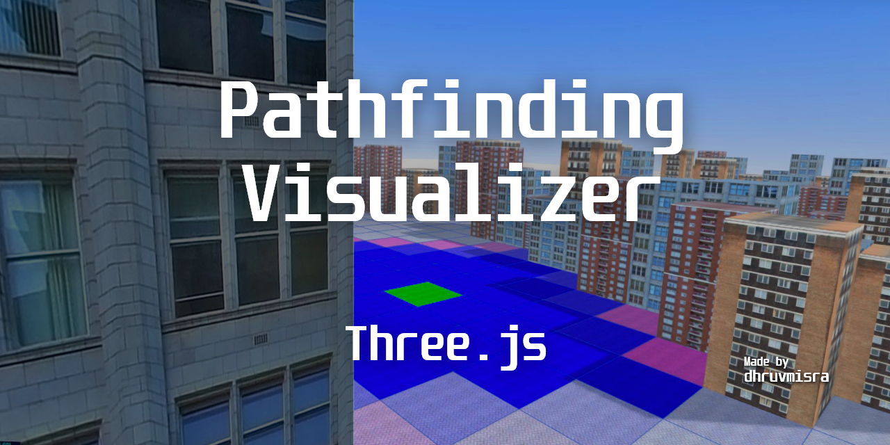

<h1 align="center">Pathfinding Visualizer ThreeJS</h1>

<div align="center">


</div>
<br>

*A Visualizer for pathfinding algorithms in 3D.*


<hr>

## Live Demo
The live demo can be found [here](https://dhruvmisra.github.io/Pathfinding-Visualizer-ThreeJS/).


## Features
### Weighted and unweighted algorithms
* **Dijkstra’s algorithm** (weighted) <br>
The father of pathfinding algorithms, it creates a tree of shortest paths from the starting vertex, the source, to all other points in the graph. <b>Guarantees</b> the shortest path!

* **A\* Search algorithm** (weighted) <br>
One of the best and a popular technique used in path-finding and graph traversals with heuristic. <b>Guarantees</b> the shortest path!

* **Breadth-First Search** (unwighted) <br>
The algorithm starts at the tree root, and explores all of the neighbor nodes at the present depth prior to moving on to the nodes at the next depth level. <b>Guarantees</b> the shortest path!

* **Depth-First Search** (unwighted) <br>
The algorithm starts at the root node and explores as far as possible along each branch before backtracking. <b>Does not guarantee</b> the shortest path!

### Maze generation
Two methods to generate a maze:
* Recursive Division
* Random

### First-Person view
Roam around the world you create in First-Person view and watch the algorithm move under your feet!


## Attributions
### Idea
Clément Mihailescu for the inception of this visualizer through his amazing [project](https://github.com/clementmihailescu/Pathfinding-Visualizer) and [YouTube channel](https://www.youtube.com/channel/UCaO6VoaYJv4kS-TQO_M-N_g)

And playing krunker.io with my friends.

### WebGL Library
Three.js

### Assets & Icons
Textures from [OpenGameArt.org](https://opengameart.org/)

Icons made by [Freepik](https://www.flaticon.com/authors/freepik) from [www.flaticon.com](https://www.flaticon.com/)

## Project setup
```
npm install
npm run serve
```

## Future Scope
* Add touch controls for first-person view
* Add visited nodes counter and path length
* Add more algorithms to visualize

<br>
<p align="center">Made with ❤️ in Vue.js</p>